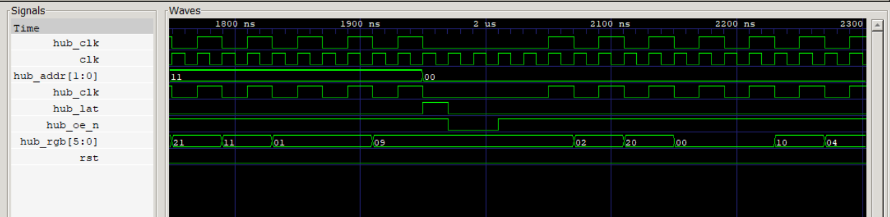
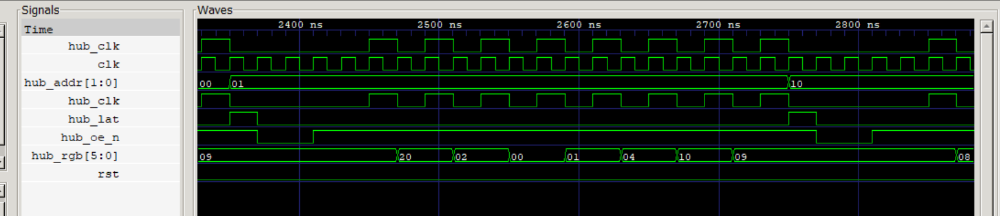

# HUB75

A scalable HUB75 RGB-LED-matrix controller written in Verilog for the Vicharak
**Shrike-fi** board (Renesas SLG47910V ForgeFPGA). **One ForgeFPGA drives one
panel.** It defaults to an **8×8** panel and is parameterised for other sizes.
Colour is produced by **Binary-Code-Modulation (BCM)**, default **4 bits per
channel (4096 colours)**.

> ## ⚠️ This is a SIMULATION-ONLY project
>
> The goal here is to **design and fully verify the HUB75 driver in
> simulation** — no board, no bitstream, no panel required. A self-checking
> testbench pretends to be a real HUB75 panel, watches the driver's output
> pins, rebuilds the displayed frame, and checks it against the source image.
>
> The RTL is written to also be synthesisable for the real ForgeFPGA, and a
> pin-mapping guide is included ([`PINOUT.md`](PINOUT.md)), **but
> taking it to hardware is out of scope** and untested on a physical board.

## Run the simulation

Requires [Icarus Verilog](http://iverilog.icarus.com/) (`iverilog` + `vvp`);
optionally [GTKWave](https://gtkwave.sourceforge.net/) for waveforms.

```bash
cd sim
make                       # Linux/macOS/Git-Bash
# or on Windows PowerShell:
powershell -File run_sim.ps1
```

Expected output — the recovered picture matches the source image exactly:

```
--- ASCII (dominant colour, '.'=off) ---
  RRRRRRRR
  RG....BR
  R.GRRB.R
  R..GB..R
  R..BG..R
  R.BRGG.R
  RB....GR
  RRRRRRRR

RESULT: PASS  (all 64 pixels x 3 channels match)
```

### Simulate other panel sizes (parameterisation)

```bash
cd sim
python gen_image.py 16 16 4 image_16x16.hex          # make a 16×16 test image
iverilog -g2012 -DP_COLS=16 -DP_ROWS=16 -DP_BPP=4 \
         -DHUB75_SIM_INIT -DHUB75_INIT_FILE='"image_16x16.hex"' \
         -o tb.vvp ../src/main.v tb_hub75.v && vvp tb.vvp
```

Verified passing: **8×8/BPP4**, **16×16/BPP4**, **32×16/BPP2**, **64×32/BPP4**,
**64×64/BPP2**, plus `BPP=1` and `BPP=8`.

---

## Waveforms

Captured in GTKWave from `sim/tb_hub75.vcd` (`make wave`). Signals shown:
`hub_clk` (shift clock), `hub_rgb[5:0]` (colour bits), `hub_lat` (latch),
`hub_addr` (row select), `hub_oe_n` (LEDs lit when low).

**One row shifted out and latched** — 8 pixels clocked in on `hub_clk`, then a `hub_lat` pulse; matches the source image bit-for-bit (`09,01,21,11,…`).


**Row advancing (row 0 → row 1)** — `hub_addr` updates at the latch and holds stable while the next row shifts.


**Row-address scan** — `hub_addr` sweeps `01 → 10 → 11`, driving every row of the panel within a bit-plane.


**Bit-plane wrap (plane 0 → plane 1)** — after row 3, `hub_addr` wraps to `00` and `hub_oe_n` starts staying low longer (BCM weight 1 → 2).


**Plane-1 scan** — the same row sweep repeats with a visibly wider `hub_oe_n` lit-time (weight 2).


**Full BCM staircase** — zoomed out: each `hub_addr` sweep is one bit-plane, and the `hub_oe_n` lit-time doubles per plane (1 → 2 → 4 → 8 clocks) — that is the 4-bit colour depth.


---

## How the code works (quick tour)

A HUB75 panel has no memory of its own — the FPGA must continuously redraw it.
The design is three small pieces in `src/main.v`:

1. **`hub75_framebuffer`** — the picture memory. `ROWS×COLS` words of `3·BPP`
   bits (`{R,G,B}`), with two read ports so the driver can fetch an upper-half
   and a lower-half pixel at once. In simulation it is preloaded from the hex
   image via `$readmemh`.

2. **`hub75_driver`** — a 3-state machine that runs forever:
   - **SHIFT** — for the current row and bit-plane, push all `COLS` pixels into
     the panel: set colour bits on `hub_rgb`, then pulse `hub_clk` (2 clocks per
     pixel; the panel captures data on the rising edge). LEDs stay blanked.
   - **LATCH** — pulse `hub_lat` to freeze the shifted line onto the LEDs, and
     drive `hub_addr` to select which row pair it belongs to.
   - **DISPLAY** — light the row (`hub_oe_n` low) for `DISP_BASE·2^plane`
     clocks, then move to the next row / bit-plane.

3. **`hub75_top`** — the pin wrapper. Satisfies the ForgeFPGA rules
   (`(* top *)`, `clkbuf_inhibit` on the clock, a `_oe` output-enable per pin
   tied high, `clk_en` high), and connects framebuffer → driver → pins.

**Colour via BCM (Binary-Code-Modulation):** an LED is only on or off, so a
shade is made by _time_. Bit-plane 0 is shown for 1 unit, plane 1 for 2, plane
2 for 4, plane 3 for 8. Over one full frame the total on-time of a channel
equals its 0–15 value, so your eye sees the right brightness.

**How the testbench verifies it (`sim/tb_hub75.v`):** it behaves like a real
panel — captures the colour bits on every `hub_clk` rising edge, measures how
long `hub_oe_n` stays low for each line (that duration _is_ the bit-plane
weight), and accumulates `bit × weight` per pixel over one frame. Dividing out
the time unit recovers the original 0–15 values, which it compares to the same
image the framebuffer was loaded with — printing **PASS** only if every pixel
and channel matches.

### Parameters (set on `hub75_top`)

| Param       | Default | Meaning                                                   |
| ----------- | ------- | --------------------------------------------------------- |
| `COLS`      | 8       | panel width in pixels (≥ 2)                               |
| `ROWS`      | 8       | panel height in pixels (even, ≥ 4)                        |
| `BPP`       | 4       | colour bits per channel (1–8)                             |
| `DISP_BASE` | 1       | display clocks for the LSB bit-plane (brightness/refresh) |

---

## Hardware bring-up (optional, out of scope)

> Not needed for the simulation. Included only as a reference in case you later
> want a real bitstream. Untested on a physical board.

Open `src/main.v` in the Go Configure Software Hub (ForgeFPGA → SLG47910 (BB)),
synthesise, map the ports in the IO Planner per [`PINOUT.md`](PINOUT.md)
(`clk`→OSC_CLK, `clk_en`→OSC_EN, each output + its `_oe` to a GPIO), and
Generate Bitstream. Pixel data would come from the ESP32-S3 by wiring
`src/spi_target.v` to the framebuffer's write port (see the snippet in
`main.v`). Pin and BRAM budgets for larger panels are in `PINOUT.md`.

## References

https://zbotic.in/hub75-rgb-panel-with-esp32-led-matrix-video-wall-build/

https://www.instructables.com/PiMatrixOS-Raspberry-Pi-HUB75-LED-Matrix-Platform-/

https://esphome.io/components/display/hub75/
